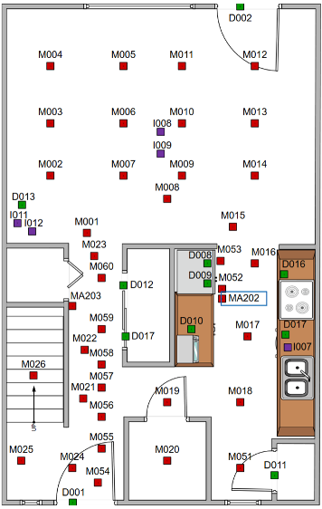

# Smart Environment Domain

## Table of Contents

* [Task Description](#taskdescription)
* [Feature Vector Format](#featurevectorformat)
* [Action Label Response and Feedback](#actionlabel)
* [Performance](#performance)
* [Novelty Indicator](#noveltyindicator)
* [Novelty Characterization](#noveltycharacterization)
* [Sample (Mock) Novelty](#samplemocknovelty)
* [Phase 1 Revealed Novelty](#phase1revealednovelty)
* [Frequently Asked Questions](#faq)

<a name="taskdescription">

## Task Description

The novelty level-0 Smart Environment task is for the agent to recognize the
current activity of the inhabitant in the environment. The agent receives
timestamped sensor data and responds with one of 11 possible activities: wash
dishes, relax, personal hygiene, bed toilet transition, cook, sleep, take
medicine, leave home, work, enter home, eat. The agent also receives feedback
about their current performance, which is the percentage of correct classifications
since the beginning of the episode. The inhabitant's behavior varies from day
to day. An episode is one day's worth of data. Sensor vectors are generated
when at least one sensor changes value, not at a fixed frequency. Below is a
sample floorplan of one of the smart environments.



See the [smartenv.json](smartenv.json) file for a precise specification of the
domain, including ranges on sensor values.

<a name="featurevectorformat">

## Feature Vector Format

The feature vector provides a value for each sensor and is sent in JSON format.
There are five types of sensors: motion, motion area, light switch, light
level, and door.  Each sensor is described by its ID and value. There may be
more than one of each sensor type.

For example,

```
{
    "time_stamp": 1597953858.2,
    "motion_sensors": [
        { "id": "M001", "value": 0.0 },
        { "id": "M002", "value": 1.0 }
    ],
    "motion_area_sensors": [
        { "id": "MA007", "value": 1.0 }
    ],
    "door_sensors": [
        { "id": "D011", "value": 0.0 }
    ],
    "light_switch_sensors": [
        { "id": "L021", "value": 1.0 },
        { "id": "L022", "value": 0.0 }
    ],
    "light_level_sensors": [
        { "id": "LL025", "value": 70.0 }
    ]
}
```

<a name="actionlabel">

## Activity Label Response and Feedback

After each sensor vector, the agent responds with one of 11 possible activity
classifications: wash\_dishes, relax, personal\_hygiene, bed\_toilet\_transition,
cook, sleep, take\_medicine, leave\_home, work, enter\_home, eat.

The agent is then provided with the correct activiy classification according to
a budget. E.g., if the budget is 50%, then the correct classificaton is provided
half the time. The budget is set within the novelty generator and made known
to the TA2 team.

<a name="performance">

## Performance

The current performance of the agent on the current episode is provided as
feedback after each agent response and is sent in JSON format. For SmartEnv,
performance is defined as classification accuracy so far, i.e. the number of
correct predictions divided by the total number of predictions. The performance
at the end of the episode is recorded as the performance for
that entire episode.

<a name="noveltyindicator">

## Novelty Indicator

After each sensor fecture vector, the novelty generator sends a novelty
indicator, which indicates if the current episode is novel "true", not novel
"false" (i.e., novelty level 0), or unknown "null". The novelty indicator will
be the same for every turn during an episode.

<a name="noveltycharacterization">

## Novelty Characterization

At the end of each episode, the agent provides a novelty characterization
for the episode, which includes a probability of novelty, probability threshold,
novelty level, and a characterization string.

<a name="samplemocknovelty">

## Sample (Mock) Novelty

The SmartEnv novelty generator includes sample Phase 2 novelties for levels 1-5,
also called Mock novelties. These are described below.

* Level 1: Some sensors turned off.
* Level 2: Inhabitant performs exact same behavior each day.
* Level 3: Activity not seen in pre-novelty, but seen in post-novelty.
* Level 4: Two sensor values always give same reading.
* Level 5: Second inhabitant simulated by overlaying copy of existing inhabitant.

<a name="phase1revealednovelty">

## Phase 1 Revealed Novelty

* Level 1 (Class): Not revealed (too close to Phase 2 novelty)
* Level 2 (Attribute): Sensors inactive in pre-novelty become active post-novelty
  * No Novelty: 0 inactive sensors become active
  * Easy: 5 inactive sensors become active
  * Medium: 10 inactive sensors become active
  * Hard: All inactive sensors become active (15-20 depending on floorplan)
* Level 3 (Representation): Partition floorplan into areas; all sensors in area have same value
  * No novelty: # areas = # sensors
  * Easy: Floorplan partitioned into 10 areas
  * Medium: Floorplan partitioned into 8 areas
  * Hard: Floorplan partitioned into 5 areas

<a name="faq">

## Frequently Asked Questions

Coming soon...

