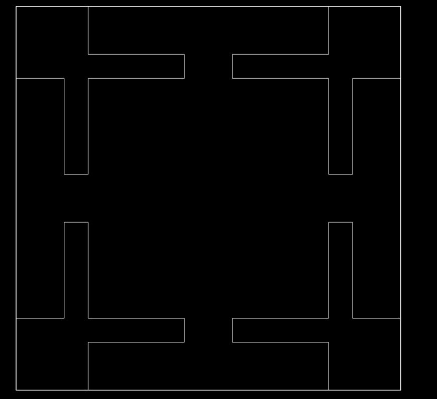

# VizDoom Domain

## Table of Contents

* [Task Description](#taskdescription)
* [Feature Vector Format](#featurevectorformat)
* [Action Label](#actionlabel)
* [Performance](#performance)
* [Novelty Indicator](#noveltyindicator)
* [Novelty Characterization](#noveltycharacterization)
* [Sample (Mock) Novelty](#samplemocknovelty)
* [Revealed Novelty](#revealednovelty)
* [Frequently Asked Questions](#faq)

<a name="taskdescription">

## Task Description

For the Phase 2 novelty-level-0 VizDoom task, the agent (player) must kill all
the enemies in the environment. The map for all Phase 2 levels is fixed and
shown below. The agent has eight actions: forward, backward, left, right, turn left
45 degrees, turn right 45 degrees, shoot and do nothing. The enemies have the same actions
(except do nothing). In level 0, the agent and 2-4 enemies spawn in random locations
in the map. Enemies move randomly, but can shoot at the agent if facing them. The
agent and enemies all use the pistol for a weapon and bullets for ammo. The agent
begins with some amount of health and ammo. Enemies also begin with some amount of
health, but infinite ammo. There are objects in the environment: health packs,
ammo packs, traps (negative health packs), and fixed obstacles. The player collects
packs by moving over them. The enemies do not collect packs.

On each turn, the agent receives sensor information about the state of the game,
including the agent's location, orientation, health and ammo; each enemy's
location, orientation and health; and the locations of all packs and obstacles.
The geometry (walls) of the map are provided in the first set of sensor information.
An optional image is also available.

The agent has 2000 game ticks to kill all the enemies. A game tick corresponds to
0.02 seconds in the game. An episode ends when either all the enemies are dead,
the agent dies, or a time limit is exceeded. The score for the episode is
(2000 - T) / 2000, where T is the time at which the agent wins the game (kills
all the enemies). If the agent dies, or runs out of time, the score is zero.



See the [vizdoom.json](vizdoom.json) file for a precise specification of the
domain, including ranges on sensor values.

<a name="featurevectorformat">

## Feature Vector Format

The feature vector provides a value for each sensor and is sent in JSON format.
The high-level sensor information includes "enemies", "items", "player", "timestamp"
and "image". The "enemies" array includes an entry for each live enemy, which
includes their ID, orientation, position, and health. The player object includes
the agent's ID, orientation, position, health and ammo. The "items" array includes
subarrays for "health", "ammo", "trap" and "obstacle". Each of these subarrays
includes ID, position and orientation information for uncollected items.
See below for an example.


```
{
    "enemies": [
        {
            "id": 1,
            "angle": 270.0,
            "x_position": 235.0094,
            "y_position": 17.6364,
            "z_position": 0.0,
            "name": "ZombieMan",
            "health": 20.0
        }
    ],
    "items": {
        "health": [
            {
                "id": 9,
                "angle": 0.0,
                "x_position": 447.5784,
                "y_position": 195.6249,
                "z_position": 0.0
            },
            {
                "id": 10,
                "angle": 0.0,
                "x_position": -287.9644,
                "y_position": 85.8104,
                "z_position": 0.0
            },
            {
                "id": 11,
                "angle": 0.0,
                "x_position": -18.8223,
                "y_position": 76.51,
                "z_position": 0.0
            }
        ],
        "ammo": [
            {
                "id": 12,
                "angle": 0.0,
                "x_position": 462.2229,
                "y_position": -174.2259,
                "z_position": 0.0
            },
            {
                "id": 13,
                "angle": 0.0,
                "x_position": 482.8499,
                "y_position": -8.8603,
                "z_position": 0.0
            },
            {
                "id": 14,
                "angle": 0.0,
                "x_position": -227.0497,
                "y_position": 123.6179,
                "z_position": 0.0
            },
            {
                "id": 15,
                "angle": 0.0,
                "x_position": -86.8704,
                "y_position": 71.5086,
                "z_position": 0.0
            }
        ],
        "trap": [
            {
                "id": 5,
                "angle": 0.0,
                "x_position": 105.1622,
                "y_position": -409.6578,
                "z_position": 0.0
            },
            {
                "id": 6,
                "angle": 0.0,
                "x_position": 218.5878,
                "y_position": 474.754,
                "z_position": 0.0
            },
            {
                "id": 7,
                "angle": 0.0,
                "x_position": 208.1536,
                "y_position": 117.6079,
                "z_position": 0.0
            },
            {
                "id": 8,
                "angle": 0.0,
                "x_position": 218.2329,
                "y_position": 5.6266,
                "z_position": 0.0
            }
        ],
        "obstacle": [
            {
                "id": 3,
                "angle": 0.0,
                "x_position": -25.2912,
                "y_position": 208.6945,
                "z_position": 0.0
            },
            {
                "id": 4,
                "angle": 0.0,
                "x_position": -52.338,
                "y_position": 473.5073,
                "z_position": 0.0
            }
        ]
    },
    "player": {
        "id": 16,
        "angle": 180.0,
        "x_position": 118.7994,
        "y_position": -284.8702,
        "z_position": 0.0,
        "health": 65.0
        "ammo": 20.0
    },
    "time_stamp": 1627669530.0396042,
    "image": null
}
```
The first call will have an additional two feature vectors:

* Walls defining the edges of the world.

```
    "walls": [
        {
            "x1": -320.0,
            "x2": -64.0,
            "y1": 320.0,
            "y2": 320.0
        },
        {
            "x1": 320.0,
            "x2": 320.0,
            "y1": 320.0,
            "y2": 64.0
        },
        ...
```
* Hints given pointers to the novelty used.
```
    Full hint example:
    "hint": {
        "level": 1,
        "entity": "trap",
        "attribute": "quantity",
        "change": "increase"
    }
    No hint example:
    "hint": {
        "level": None,
        "entity": None,
        "attribute": None,
        "change": None
    }
```

<a name="actionlabel">

## Action Label

Each turn, the agent provides an action to be performed, which is one of
['nothing', 'left', 'right', 'forward', 'backward', 'shoot', 'turn_left', 'turn_right', 'give_up'].
The returned action is
referred to as the "label", which is an artifact of other domains in which
the task is classification.

<a name="performance">

## Performance

The current performance of the agent on the current episode is provided as
feedback after each agent response and is sent in JSON format. For VizDoom,
performance is defined as the amount of time left in the episode divided by
the maximium time for the episode. The performance at the end of
the episode is recorded as the performance for that entire episode.

<a name="noveltyindicator">

## Novelty Indicator

After each sensor fecture vector, the novelty generator sends a novelty
indicator, which indicates if the current episode is novel "true", not novel
"false" (i.e., novelty level 0), or unknown "null". The novelty indicator will
be the same for every turn during an episode.

<a name="noveltycharacterization">

## Novelty Characterization

At the end of each episode (train and test), the agent provides a novelty characterization, which includes: 
a list of novelty levels [0, 8] and their probabilities [0.0, 0.1], 
an entity characterization string, 
an attribute characterization string, 
and directional change string.

TA2s must report at least the novelty levels and their probabilities. Missing levels will be presumed to be 0.0.

It should look like:
```
    "novelty_characterization": {
        'level': [
            {'level_number': int, 'probability': float},
            ...,
            {'level_number': int, 'probability': float}
        ], 
        'entity': str, 
        'attribute': str, 
        'change': str
    }
```
Available options for entity, attribute, and change:
    
* Entity: enemy, player, health, ammo, trap, obstacle, walls, location (+ Action)
  * Action: nothing, left, right, forward, backward, shoot, turn_left, turn_right
* Attribute: quantity, size, value, speed, direction, position, health, damage, ammo, angle
* Change: increase, decrease, increasing, decreasing, away <entity>, toward <entity>, shift
    
<a name="samplemocknovelty">

## Sample (Mock) Novelty

The VizDoom novelty generator includes sample Phase 2 novelties for levels 1-5,
also called Mock novelties. These are described below.

* Level 1: Change in number of health packs.
* Level 2: Enemies have increased speed.
* Level 3: Enemies move toward player.
* Level 4: Enemy damage increases as closer to player.
* Level 5: Enemies spread out.
* Level 6: Wind force added.
* Level 7: Enemies move behind obstacles.
* Level 8: Ammo and Health packs disappear over time.

The implementations of these mock novelties can be found in the folder
[WSU-Portable-Generator/source/partial_env_generator/envs/vizdoom/wad_reduced/SCRIPTS.txt](https://github.com/holderlb/WSU-SAILON-NG/tree/master/WSU-Portable-Generator/source/partial_env_generator/envs/vizdoom/wad_reduced/SCRIPTS.txt).

<a name="samplehints">

## List of Mock Hints

Table of how hints are returned using hint level:

HintLevel | NoveltyLevel | Entity | Attribute | Change
---|---|---|---|---
-1 | None | None | None | None
0 | Given | None | None | None
1 | Given | Given | None | None
2 | Given | Given | Given | None
3 | Given | Given | Given | Given

Table of hints for mock novelties:

Level | Entity | Attribute | Change
---|---|---|---
1 | health | quanatity | decrease
2 | enemy | speed | increase
3 | enemy | direction | toward player
4 | enemy | damage | increasing
5 | enemy | direction | away enemy
6 | enemy | position | shift
6 | player | position | shift
7 | enemy | direction | toward obstacle
8 | ammo | quantity | decreasing
8 | health | quantity | decreasing

<a name="revealednovelty">

## Revealed Novelty

### Phase 1

* Level 1 (Class): Change in size of enemy hit box (smaller means harder to hit)
  * No novelty: Size = 20
  * Easy: Size = 15
  * Medium: Size = 10
  * Hard: Size = 5

* Level 2 (Attribute): Change in enemy health and available ammo packs (+15 ammo each)
  * No novelty: Health = 10hp (3 shots to kill), 2-4 ammo packs
  * Easy: Health = 20hp (~5 shots to kill)
  * Medium: Health = 30hp (~7 shots to kill)
  * Hard: Health = 40hp (~9 shots to kill)
* Level 3 (Representation): Decrease position precision by bucketizing position values
  * No novelty: Maximum floating point precision
  * Easy: Discretize position values into 50 buckets
  * Medium: Health = Discretize position values into 40 buckets
  * Hard: Health = Discretize position values into 30 buckets

### Phase 2

* Level 1 (Objects): Increase in number of traps.
  * No novelty: 1-4 traps
  * Easy: 10-15 traps
  * Medium: 20-25 traps
  * Hard: 30-35 traps

* Level 2 (Agents): Increase in enemy damage.
  * No novelty: Damage per hit = 5
  * Easy: Damage per hit = 14-17
  * Medium: Damage per hit = 19-21
  * Hard: Damage per hit = 24-26

* Level 3 (Actions): Enemies teleport away after being shot
  * No novelty: No teleportation after being shot
  * Easy: Teleport distance of 300-400
  * Medium: Teleport distance of 500-600
  * Hard: Teleport distance of 700-800

* Level 4 (Relations): Health decreases if player near wall or obstacle
  * No novelty: No health decrease near walls and obstacles
  * Easy: Health decreases by 1 per tick
  * Medium: Health decreases by 2 per tick
  * Hard: Health decreases by 5 per tick

* Level 5 (Interactions): After some time, enemies change to sentry mode (aim and shoot with no randomness)
  * No novelty: Enemies always move randomly
  * Easy: Change to sentry mode after 10 ticks
  * Medium: Change to sentry mode after 5 ticks
  * Hard: Change to sentry mode immediately

<a name="faq">

## Frequently Asked Questions

The below FAQ refers to Phase 2. Answers may change for Phase 3.

1. Why doesn't the sensor data include information on projectiles?

   * Projectiles have been removed from the game. There is only one weapon (pistol) and one ammo type (bullets).

2. How will novel objects and attributes appear in the JSON sensor information?

   * The object types and their attributes, as shown in the sample JSON above, are fixed. No new object types or attributes will appear in the JSON.

3. Can the player shoot over ammo/health packs and traps? Is this the same for enemies?

   * Yes, the player and enemies can shoot over health/ammo/traps but not through obstacles or walls.

4. Do bullets penetrate enemies? Can enemies damage each other?

   * Bullets do not pass through enemies. Enemies can damage each other.

5. Can enemies hit traps?

   * No. Enemies do not pick up health packs, ammo packs, or traps. This may change post-novelty.

6. How much damage does each bullet do?

   * Each bullet (player and enemy) does approximately 5 damage, depending on the armor level. Enemies start with 10hp and 5points of armor, which results in 3-4 shots to kill. These values may change post-novelty.

7. Does a player have a maximum ammo cap?

   * The player has a maximum cap of 200 for both health and ammo. The enemy has infinite ammo.

8. How large (x,y) are each of the items and agents?

   * Objects in the game are defined by a radius R and height H. The (x,y) size of an object is (2R x 2R). The H and R for VizDoom objects are defined in ``ViZDoom/src/vizdoom/wadsrc/static/actors/`` on the [VizDoom GitHub](https://github.com/mwydmuch/ViZDoom). For the player, R = 16 and H = 56. For the enemies (ZombieMan), R = 20 and H = 56. Obstacles, R = 16 and H = 52. For health packs, ammo packs and traps, R = 20 and H = 52.

9. Is the ID counter global (i.e., playerID and enemyID cannot be the same value)?

   * ID's are unique per object. So, no two object have the same ID. However, objects may not have the same ID from game to game.

10. Can we setup levels in a specific configuration (objects, agents in specific locations)?

    * You can do this by modifying or replacing the novelty level WAD file (
``WSU-SAILON-NG/WSU-Portable-Generator/source/partial_env_generator/envs/vizdoom/phase_2_reduced.wad``). A more readable version of the WAD file is in the directory ``WSU-SAILON-NG/WSU-Portable-Generator/source/partial_env_generator/envs/vizdoom/wad_reduced``. To get started with editing Doom scenarios, see [Custom Scenarios](http://vizdoom.cs.put.edu.pl/tutorial#scenarios).
    
11. Are obstacles fixed?
    
    * Obstacles have a large mass but can move a very small amount when moved into or when shot. 
